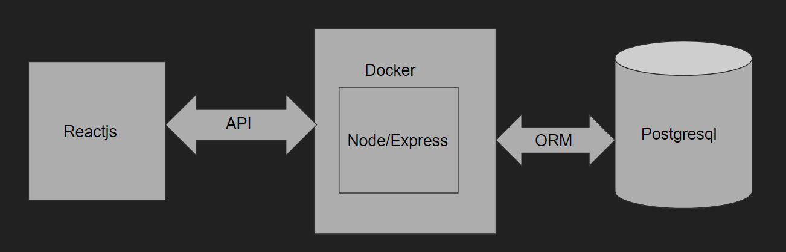

# TiketiYetu
 _Don't just go to the show, treade the ticket too_

 ## Introduction
 Easy way to buy and sell _Tickets_ for concerts, events and meetups,
 where can buy and resell his/her ticket to other users

 ## Context
 This project is my Portfolio Project, concluding my Foundations Year at [ALXSE](https://www.alxafrica.com/).

 ## Team
 I worked this project alone.

 ***Ayub Sheikh*** [@ayubsh](https://github.com/ayubsh)

## Blog Post
- upcoming

## Architecture
The web app is a single-page app, coded mainly in Javascript and Reactjs. I designed most of the User Interface, using plain Tailwinf CSS.
The backend/server is coded also in Javascript with Postgresql as its database. I dockerized the backed with its database to make it easy for deployment

## User flow


## How to run
Clone the repo to your computer. 

also make user you have [Docker](https://www.docker.com/) in your system 
```sh
git clone git@github.com:ayubsh/TiketiYetu.git
cd TiketiYetu
```
## Backedend
```sh
cd TicketiYetu/backend
npm install
```
Set up environment variables in __.env__ file
```sh
POSTGRES_USER="db_user"
POSTGRES_HOST="db_host"
POSTGRES_PASSWORD="your_password"
POSTGRES_DATABASE="db_name"
```
Setup Docker-compose
```sh
docker-compose up --build -d
```

## Client
```sh
cd TiketiYetu/client
npm install
npm run dev
```

# Acknowledgments
__The [ALXSE](https://www.alxafrica.com/) community, staff, cohort 11 and all [ALXSE](https://www.alxafrica.com/) students thanks for all For the help, advice and resources they provided me  during this project and during all our curriculum over the last year.__